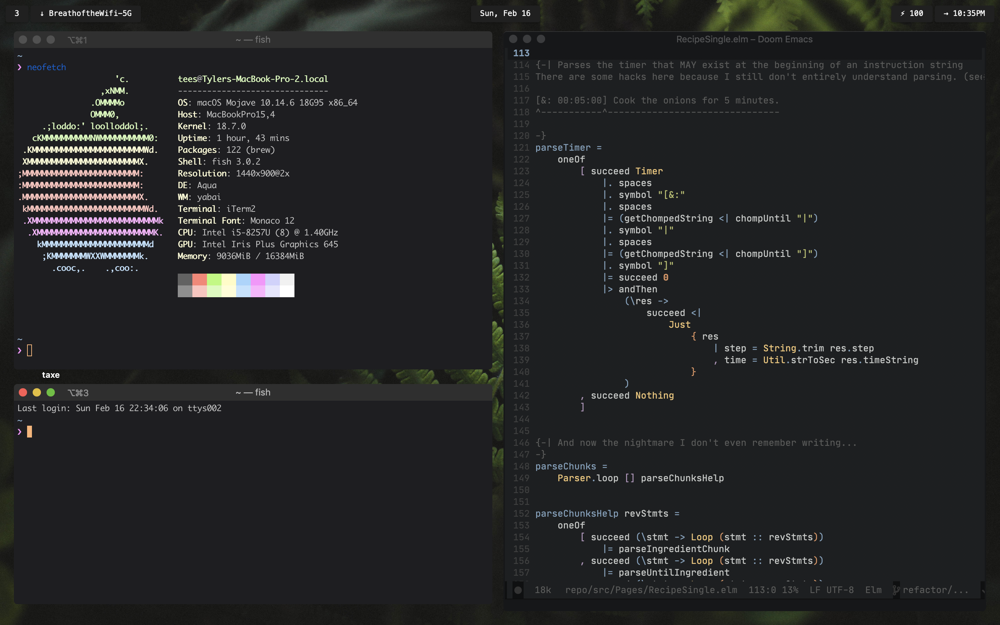

> Dotfile Scrapheap

**Installation**

1. Clone the repo
1. run `sh boot.exclude.sh all` and follow the prompts.
1. ~(˘▾˘~) (~˘▾˘)~

**Updating**

There are submodules in this repo (doom-emacs and zim as of now). 
Run: `boot.exclude.sh update`
